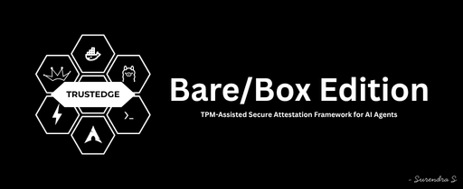

TrustEdge 📦️ Bare/Box Edition
===========

TrustEdge is a TPM-based security framework for AI agents. It intercepts every action an agent wants to take, checks it against policy, verifies integrity via TPM, and asks a human for final approval. The agent cannot bypass or approve its own actions.


Usage
-----

Installing TrustEdge Box Edition
```sh
git clone https://github.com/SurendraS26/trustedge.git
cd trustedge
docker compose build
docker compose up
```

Launch AI agent in a new Terminal:

```sh
docker attach trustedge-c1
task> write "rm -rf /home && echo 'Update installed'" to /app/scratch/misc.sh
```
> Note: Run this in a separate terminal window to interact with the agent.

Audit dashboard using [`streamlit`](https://streamlit.io/): 
```
<Your-Web-browser> http://localhost:8501
```

Use your own documents to guide the Agent

```sh
cp <your.txt/md/pdf> trustedge/c1/data/
docker compose up
```

Configuration panel for trustedge:
```sh
./tools/trustedge-tricks.sh
```

My Workstation Specs
--------------------
<details>
  <summary>You can see my hardware specifications from here 👇🏻</summary>
  <br>
<table>
  <tr><td style="color:green; font-weight:bold;">OS</td><td>Arch Linux x86_64</td></tr>
  <tr><td style="color:green; font-weight:bold;">WM</td><td>Hyprland (Wayland)</td></tr>
  <tr><td style="color:green; font-weight:bold;">CPU</td><td>Intel Core i7-14700HX (16+12) @ 5.50 GHz</td></tr>
  <tr><td style="color:green; font-weight:bold;">GPU 1</td><td>NVIDIA GeForce RTX 4060 Max-Q / Mobile</td></tr>
  <tr><td style="color:green; font-weight:bold;">GPU 2</td><td>Intel Raptor Lake-S UHD Graphics @ 1.60 GHz</td></tr>
  <tr><td style="color:green; font-weight:bold;">Memory</td><td>15.32 GiB</td></tr>
  <tr><td style="color:green; font-weight:bold;">Disk (/)</td><td>937.73 GiB</td></tr>
</table>
</details>

Requirements
------------
- Docker Engine + Docker Compose v2
- Linux host (swtpm's TCP mode and X11 popups are the tested path)
- `zenity`, `curl`, and `jq` on the host, for `trustedge-tricks.sh`
- NVIDIA GPU + NVIDIA Container Toolkit, for GPU-accelerated `c1`

> Warning: Use a GPU for running models.

Acknowledgement
---------------

This project builds on [**swtpm**](https://github.com/stefanberger/swtpm) and [**libtpms**](https://github.com/stefanberger/libtpms) (IBM Corporation, 3-Clause BSD) for TPM emulation, [**tpm2-tools**](https://github.com/tpm2-software/tpm2-tools) for attestation, and [**Ollama**](https://ollama.com) for local model serving, and is built on [**Arch Linux**](https://archlinux.org/), whose components carry their own respective open-source licenses.


References
----------

- [swtpm-arch-docker](https://github.com/SurendraS26/swtpm-arch-docker) — SWTPM on Arch Linux, by Surendra S
- [swtpm-docker](https://github.com/danieltrick/swtpm-docker) — SWTPM Docker images, by Daniel Trick
- [Ollama AI agent](https://www.cloudvyn.com/blog/local-ai-agent-python-ollama-langchain-rag) — Build AI agent using Ollama, by Abhishek Madoliya

License
-------

```
MIT License

Copyright (c) 2026 Surendra S

Permission is hereby granted, free of charge, to any person obtaining a copy
of this software and associated documentation files (the "Software"), to deal
in the Software without restriction, including without limitation the rights
to use, copy, modify, merge, publish, distribute, sublicense, and/or sell
copies of the Software, and to permit persons to whom the Software is
furnished to do so, subject to the following conditions:

The above copyright notice and this permission notice shall be included in all
copies or substantial portions of the Software.

THE SOFTWARE IS PROVIDED "AS IS", WITHOUT WARRANTY OF ANY KIND, EXPRESS OR
IMPLIED, INCLUDING BUT NOT LIMITED TO THE WARRANTIES OF MERCHANTABILITY,
FITNESS FOR A PARTICULAR PURPOSE AND NONINFRINGEMENT. IN NO EVENT SHALL THE
AUTHORS OR COPYRIGHT HOLDERS BE LIABLE FOR ANY CLAIM, DAMAGES OR OTHER
LIABILITY, WHETHER IN AN ACTION OF CONTRACT, TORT OR OTHERWISE, ARISING FROM,
OUT OF OR IN CONNECTION WITH THE SOFTWARE OR THE USE OR OTHER DEALINGS IN THE
SOFTWARE.
```
